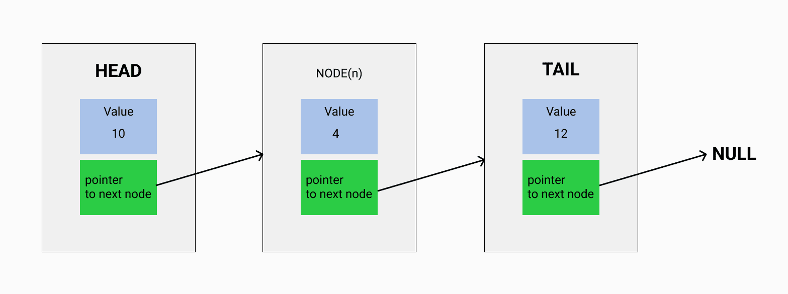

<h1>Linked Lists</h1>

A list linked in sequence, and each item(node) has 2 informations: The <strong>value</strong> and the <strong>pointer to next element</strong>.

<h2>Nice references</h2>
<ul>
  <li> <a href="https://visualgo.net/en/list">Example how to linked lists work</a></li>
</ul>

<h2>Characteristics</h2>
<ul>
  <li>The first node is called HEAD</li>
  <li>Last node is called TAIL</li>
  <li>The element points to the next element</li>
  <li>The last element points to null</li>
  <li>Javascript doesn't have linked lists implemented by default</li>
</ul>

<h2>Performance in worst case</h2>
<ul>
  <li>O(n): Insert</li>
  <li>O(n): Delete </li>
  <li>O(n): lookup</li>
  <li>O(1): append</li>
  <li>O(1): prepend</li>
<ul>
